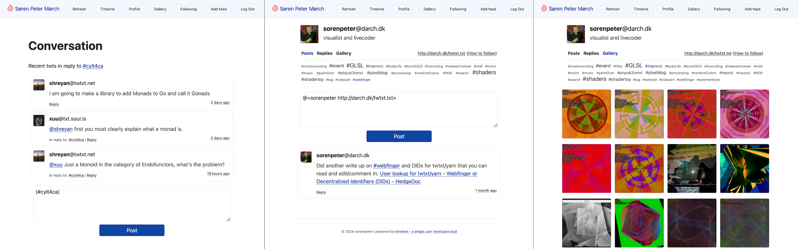

# 🌀 timeline - create you own social website

Created by sørenpeter (www.darch.dk)

So are you also tired of having to use big tech's social medias to stay connected with friends and interesting people, and having your privacy pried upon?

And are you a creative human, who want back control over you art, music, words, code, instead of having to shoehorn your soul into the grid of blackbox algoritmes?

Then it is you, who I've made timeline for.

## 🧶 What is timeline and twtxt/yarn?

timeline is a handfull of small files that you upload to a server and access it via a browser.
It then gives you an interface for posting words, links (and images too, soon), as well as following other peoples feeds and enganging in conversations by posting replies.

For the social features timeline are using the [twtxt](https://twtxt.readthedocs.io) format and most of the [Twtxt Extensions](https://dev.twtxt.net) developed in the context of [Yarn.social](https://yarn.social/).

timeline also support its own flavour of webmentions, so it is posible to be notified about `@mentions` from feeds you are not currenly/yet following.
You can also search for others feeds using [WebFinger](https://webfinger.net/), if they got that set up on their servser, like it's the case for most yarn.social pods.

My visions for timeline is to bring back the fun and quirckness of bygone sites such as Geocities of the 1990s and Myspace of the 2000s, that enables creating a personlised place for you to express yourself online and also being able to follow others who inspire you. At the same time providing a good looking basic design with the help of [Simple.css](https://simplecss.org), which allows you to customise the look and feel. Even to the level where timeline aligns with the design of your excsing webpage, like I did on: [darch.dk/timeline](https://darch.dk/timeline).


_Conversation view with replies / Profile view / Gallery View_

## 🚨 DISCLAIMER / WARNING

I'm not a professional programmer, so this software might lead to data lose or making your website unsecure in unforeseen ways.

THE SOFTWARE IS PROVIDED "AS IS", WITHOUT WARRANTY OF ANY KIND, EXPRESS OR IMPLIED,
INCLUDING BUT NOT LIMITED TO THE WARRANTIES OF MERCHANTABILITY, FITNESS FOR A
PARTICULAR PURPOSE AND NONINFRINGEMENT. IN NO EVENT SHALL THE AUTHORS OR COPYRIGHT
HOLDERS BE LIABLE FOR ANY CLAIM, DAMAGES OR OTHER LIABILITY, WHETHER IN AN ACTION
OF CONTRACT, TORT OR OTHERWISE, ARISING FROM, OUT OF OR IN CONNECTION WITH THE
SOFTWARE OR THE USE OR OTHER DEALINGS IN THE SOFTWARE.

## 🛠 Installation and setup

0. You need to have a webhosting with **PHP 8** and perferable running Apache or similar for timeline to work.
	
	> There are free options, but I would suggest that you pay for your hosting and also get a nice domain, so you have more ownership over your data and online idetenty.

1. Download the code from https://github.com/sorenpeter/timeline as a zip

2. Upload the content of the zip to you webhosting using a FTP client
	
	- The default would be to put eveything from within the timeline-main folder in the root so you will have:

	```
	www.example.net/timeline/            (go here to see your timeline)
	www.example.net/timeline/gallery/    (go here to see your gallery)
	www.example.net/timeline/post/       (go here to post to your feed)
	www.example.net/twtxt.txt            (where you feed lives and other can follow you)
	www.example.net/avatar.png           (your pretty picture)
	```

	- or you can rename the folder `timeline` to something else

3. Go to the `private` folder and make a copy of `config_template.ini` and save it as `config.ini`

4. Open `config.ini` and edit the setting to you liking and setup

5. Open up `www.example.net/timeline/` in your browser and check for any errors

### Webfinger endpoint setup

6. For allowing others to look you on using webfinger, you need to move the `.well-known` folder from within the `_webfinger_endpoint` to the root of your domain, so it is accesable from www.example.net/.well-know/webfinger 

7. You also need to edit the `index.php` file wihtin the `.well-know/webfinger` folder and set the correct path for you timeline installation in `$timeline_dir` variable.


## 🎨 Customization

- Upload your own `avatar.png` (can also be a .jpg or .gif)
	- Edit your `twtxt.txt` and `config.ini` with the correct path

- Copy `custom_template.css` to `custom.css` and try changinge the coloers to you liking


# TODO

## 🐞 Bugs to fix

- Fix issues with parsing markdown vs. twtxt syntax
	- replace slimdown with our own basic parser, supporting lists, block quotes, code/blocks, links, images


## 🚀 Features to code

- Make profile the default view, if user is not logged in (redo routing code)

- UI for uploading images
- UI buttoms for markdown when making post

- Backend: Thumbnail cache support, to avoid loading all images in full resolution when viewing a gallery

# 🙏 Credits / shoutouts

## Ideas and inspiration 

- [twtxt](https://twtxt.readthedocs.io) - The original decentralised, minimalist microblogging service for hackers

- [yarn.social](https://yarn.social) - The multi-user pods allowed everyone to use twtxt as a social media without selfhosting

- [groovy-twtxt](https://git.mills.io/mckinley/groovy-twtxt) - A curated list of groovy twtxt-related projects

## Code by others

- [twtxt-php](https://github.com/eapl-gemugami/twtxt-php) - A minimalistic and personal PHP site for your twtxt microblogging.

- [Slimdown](https://github.com/jbroadway/slimdown) - A simple regex-based Markdown parser in PHP. 

- Tag cloud feature is based on php code by [Domingos Faria](https://social.dfaria.eu/search)

